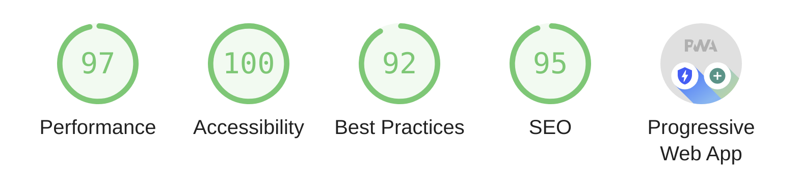

# react-github-pages

Slightly customized out-of-the-box Reactjs template for deployment on Github Pages.

### Table of Contents

- [react-github-pages](#react-github-pages)
    - [Table of Contents](#table-of-contents)
    - [Description](#description)
      - [Get Started](#get-started)
    - [Dependencies](#dependencies)
    - [Demo](#demo)
    - [Resources](#resources)

### Description

A completely React-based single-page client-side web app for a simple personal website hosted on Github Pages. Pre-implemented features include a navigation bar and homepage carousel. All React rendering is implemented through JSX. This simple website is designed to meet Google's standards for a progresive web app via lighthouse score:

#### Get Started

- Customize this application by editing the React (`.js`) files in the `/src` folder of the source code. 
- The browser icon can be changed by replacing `/public/favicon.ico`, and all the main CSS is in `App.css`. 
- You can insert images by importing them into the respective React file and sourcing using JSX syntax.

### Dependencies

- `create-react-app`
- `@brainhubeu/react-carousel`
- `gh-pages`

### Demo

Demo at: https://calvang.github.io/react-github-pages/

### Resources

https://create-react-app.dev/docs/deployment/#github-pages-https-pagesgithubcom